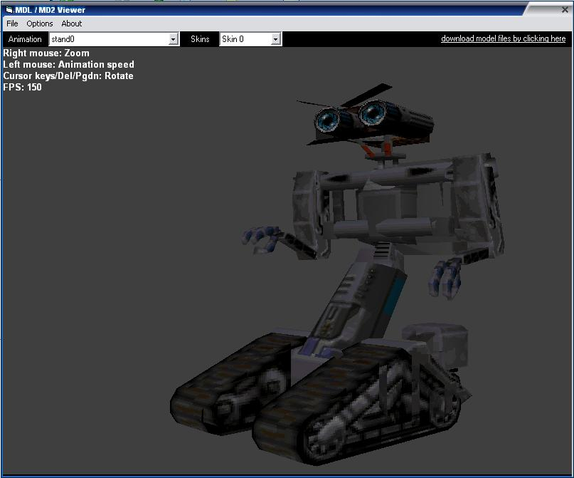



## MDL/MD2 Model Viewer \(updated\)

### Description

This program load's and renders MDL and MD2(Quake 1&2) models. the code is well commented and optimized. uses no external controls or dll's for loading/drawing except DirectX. all mdl related functions are brought together in one handy class, such as loading, rendering, animation selection, texture loading and frame interpolation! check it out
 
### More Info
 
Uses DirectX

             |
---                |---
**Submitted On**   |2004-04-03 03:28:46
**By**             |[TPD Software](https://github.com/Planet-Source-Code/PSCIndex/blob/master/ByAuthor/tpd-software.md)
**Level**          |Advanced
**User Rating**    |5.0 (15 globes from 3 users)
**Compatibility**  |VB 5\.0, VB 6\.0
**Category**       |[DirectX](https://github.com/Planet-Source-Code/PSCIndex/blob/master/ByCategory/directx__1-44.md)
**World**          |[Visual Basic](https://github.com/Planet-Source-Code/PSCIndex/blob/master/ByWorld/visual-basic.md)
**Archive File**   |[MDL\_MD2\_Mo173055482004\.zip](https://github.com/Planet-Source-Code/tpd-software-mdl-md2-model-viewer-updated__1-52912/archive/master.zip)

